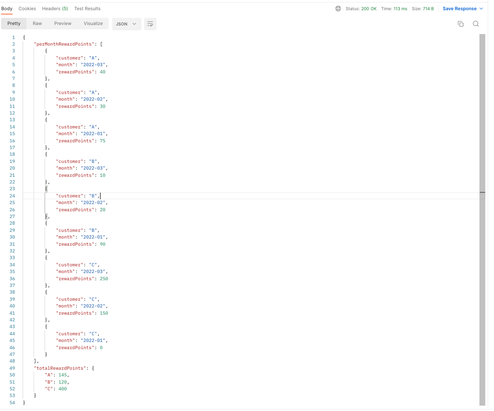
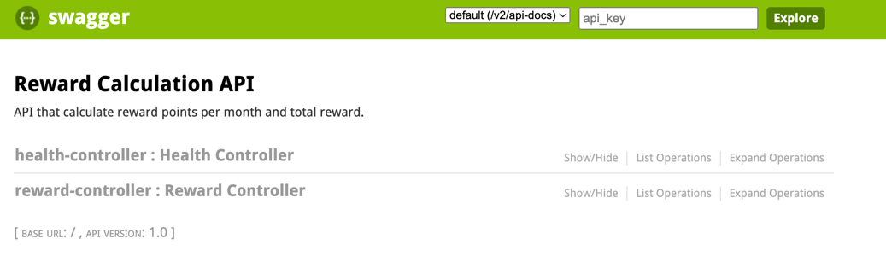
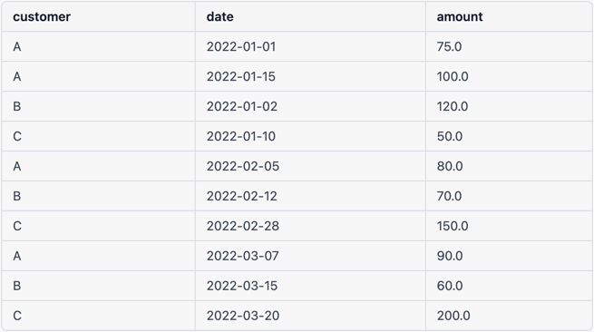
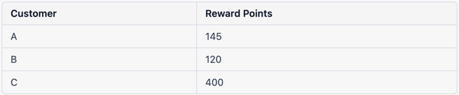

# Spring Boot Application for Reward Summary API

This Spring Boot application provides a REST API for calculating reward points for customers based on their purchases.

## Requirements
- Java 11
- Maven

## How to Start the Application

1. Clone this repository
2. Open a terminal and navigate to the project root directory 
3. Run `mvn test` to run all test cases (optional)
4. Run `mvn clean package` to build the application
5. Run `java -jar target/codingChallenge-0.0.1-SNAPSHOT.jar` to start the application

## API Documentation

### `http://localhost:8080/api/reward-summary` [POST]

This endpoint calculates the reward points for customers based on their purchases.

#### Request Body

The request body should be a JSON array of purchase data. Here's an example:

```json
[
  {
    "customer": "A",
    "date": "2022-01-01",
    "amount": 75.0
  },
  {
    "customer": "A",
    "date": "2022-01-15",
    "amount": 100.0
  },
  {
    "customer": "B",
    "date": "2022-01-02",
    "amount": 120.0
  },
  {
    "customer": "C",
    "date": "2022-01-10",
    "amount": 50.0
  },
  {
    "customer": "A",
    "date": "2022-02-05",
    "amount": 80.0
  },
  {
    "customer": "B",
    "date": "2022-02-12",
    "amount": 70.0
  },
  {
    "customer": "C",
    "date": "2022-02-28",
    "amount": 150.0
  },
  {
    "customer": "A",
    "date": "2022-03-07",
    "amount": 90.0
  },
  {
    "customer": "B",
    "date": "2022-03-15",
    "amount": 60.0
  },
  {
    "customer": "C",
    "date": "2022-03-20",
    "amount": 200.0
  }
]
```
#### Response


### Swagger UI
API can be tested on Swagger UI. Go to `http://localhost:8080/swagger-ui.html#/`. Health check interface is also there.



## Dataset Details
### Transactions (Purchases):

### Reward Points per month:

### Total Reward Points for each customer:
